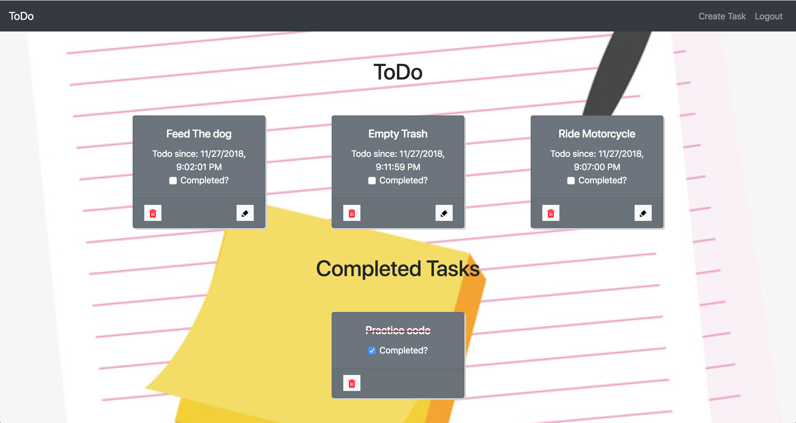
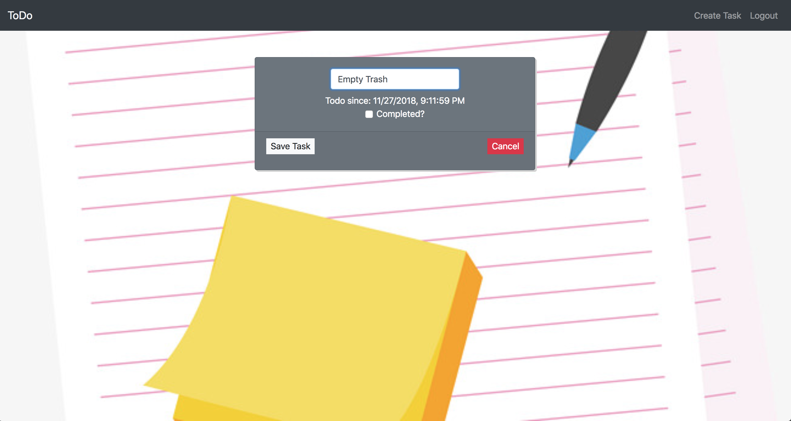

# Todo Task Maker App

For this project we needed to create an app to display tasks needing to be done. The tasks should be editable. Completed tasks should move to the completed task div.




### Technologies Used
* SASS
* Webpack
* Axios
* ES6 Modules
* Bootstrap4
* jQuery
* Firebase

### How to run this app
Please Note: A Firebase account is needed to run this app

1. Configure Firebase
* Clone the repository to your computer
* In your terminal ```npm install```
* Rename apiKeys.json.example to apiKeys.json in the db folder
* Create a new project in Firebase
* Copy the keys from Firebase into the apiKeys.json file
* Create a realtime databse in Firebase, and start in test mode
* Import tasks.json into the Firebase database to seed data

2. Serve up the app
* Run ```npm start``` in your terminal to initiate the app.
